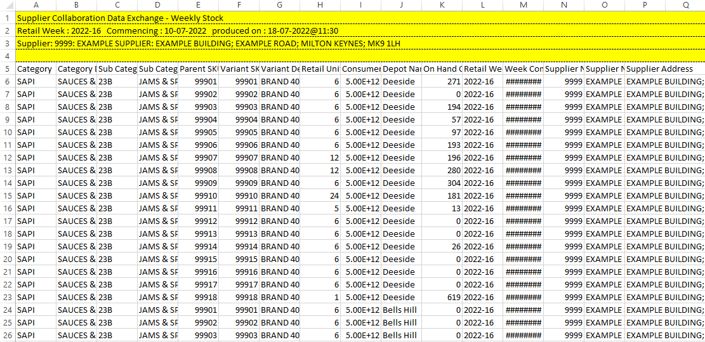

# Weekly Depot Stock File

## General Report Overview

### Source report: Weekly Stock Report

The report consists of one table of columnar data with one row per SKU. There are 9 attribute columns followed by a variable number of metric columns, depending on the number of depots referenced. The table has a header row with descriptions of the columns.

The data table is proceeded by a header of 4 rows, which contain data regarding the date and supplier context.&#x20;

## Preparation Procedure

### 1. a) Remove Estate Specific Columns

Remove the last 4 columns in the table.

These columns have the description:

* On Hand Cases Depots
* On Hand Cases Store
* On Hand Cases Company
* Stock Cover (Days)


As the number of depot columns preceding is variable, the columns ID's to be removed at this stage are not fixed.&#x20;


<figure><figcaption>
Columns to be removed in yellow
</figcaption></figure>

### 1. b) Remove Estate Specific Columns

Remove columns 10 to 16 in the table.

These columns have the description:

* Shelf Life (Days)
* Ordered Cases Depot
* Delivered Cases Depot
* Depot Service Level
* Delivered Cases Store
* Depot Forecasted Cases
* On Order Cases Depot


If using a spreadsheet application the new columns will be inserted at J:P or C10:C16 (depending on reference style)


<figure><figcaption>
Columns to be removed in yellow
</figcaption></figure>

### 2. Pivot depot columns

The remaining "On Hand Cases" metric columns all pertain to individual depots, the number of which is variable. These must be "pivoted" so that:

* Column 10 in the table contains the depot name (extracted from each depot metric column header)
* Column 10 is named "Depot Name"
* Column 11 contains the "On Hand Cases" value for the relevant depot and product
* Column 11 us named "On Hand Cases"
* Columns 1 to 9 are repeated for each row (with the appropriate "On Hand Cases" value against each product)


Carrying out this procedure changes the "grain" of the data to now include depot


<figure><figcaption>
New columns in yellow NB: Repetition of products for each depot
</figcaption></figure>

### 3. Add columns to data table

5 new columns must be added to the data table with the following column descriptions added to the table header row:

1. Retail Week
2. Week Commencing
3. Supplier Number
4. Supplier Name
5. Supplier Address


If using a spreadsheet application the new columns will be inserted at L:P or C12:C16 (depending on reference style)


<figure><figcaption>
New columns to be added in yellow
</figcaption></figure>

### 3. Extract data from header and populate new columns

1. From the second row of the header, extract the "Retail Week" value.  Populate all rows in the new **Retail Week** column with the value.
2. From the second row of the header, extract the "Commencing" value.  Populate all rows in the new **Week Commencing** column with the value.
3. From the third row of the header, extract the first component (components separated by ":") of the "Supplier" value.  Populate all rows in the new **Supplier Number** column with the value.
4. From the third row of the header, extract the second component (components separated by ":") of the "Supplier" value.  Populate all rows in the new **Supplier Name** column with the value.
5. From the third row of the header, extract the third component (components separated by ":") of the "Supplier" value.  Populate all rows in the new **Supplier Address** column with the value.


All values should be trimmed to remove surrounding white space before being written into the new columns


<figure><figcaption>
Extracted header information in red, populated columns in orange
</figcaption></figure>

### 4. Remove header rows

Delete the top 4 rows of the file, so that the header of the data table is the first row in the file.

<figure><figcaption>
Rows to be removed in yellow
</figcaption></figure>

<figure><figcaption>
Header rows removed
</figcaption></figure>

### 4. Save the file

Save the file as CSV type with UTF-8 encoding.

## File Attributes

| Aspect        | Attribute                                  |
| ------------- | ------------------------------------------ |
| Columns       | 16                                         |
| Rows          | 1 -> \~2,500 (depending on number of SKUs) |
| Header Row    | Yes                                        |
| Data Protocol | File                                       |
| File Type     | CSV                                        |
| Encoding      | UTF-8                                      |
| Date Format   | dd-mm-yyyy                                 |

## Test Regime

| Test                     | Expected Output                                 |
| ------------------------ | ----------------------------------------------- |
| File Type                | CSV with UTF-8 encoding                         |
| File Size                |                                                 |
| Number of columns        | 16                                              |
| Number of Rows           | >1                                              |
| Date Format              | dd-mm-yyyy                                      |
| SKU x Depot Combinations | Row count = Distinct Products x Distinct Depots |

## File and Column Definitions


[weekly-depot-stock-file-definition.md](weekly-depot-stock-file-definition.md)


## Example File


[example-file.md](example-file.md)

